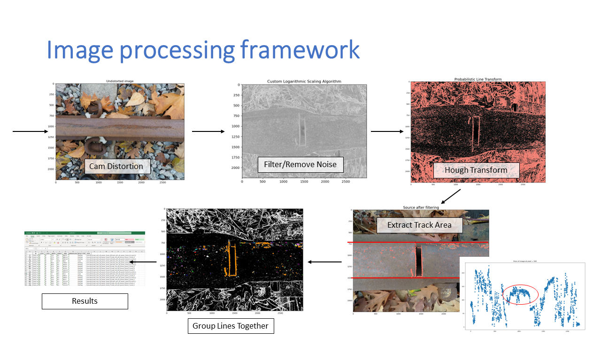
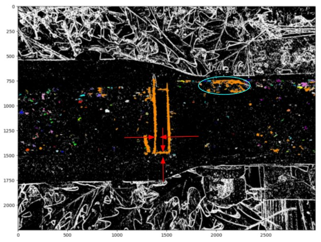

# FindIt

Framework to visualise and analyse track defects on Raspberry Pi 4 with Python: 

- Custom Canny Edge/Hough Transform detection Algorithm
- Machine Vision Algorithm
- Sensor communication with Pi

Detailed Idea and Video Explanation: https://www.youtube.com/watch?v=QuylfWpTdOo&list=PL2kV0kWfWM3CIzJsxYMH7DIDV_0zAp3Bp&index=2

Screenshots: 

  
Data path from collection to result

  
Crack and Shelling defect recognition

\n
Created with: Lauren  Puumala, Max Aplas, Clay Konrad, Cynric Li
